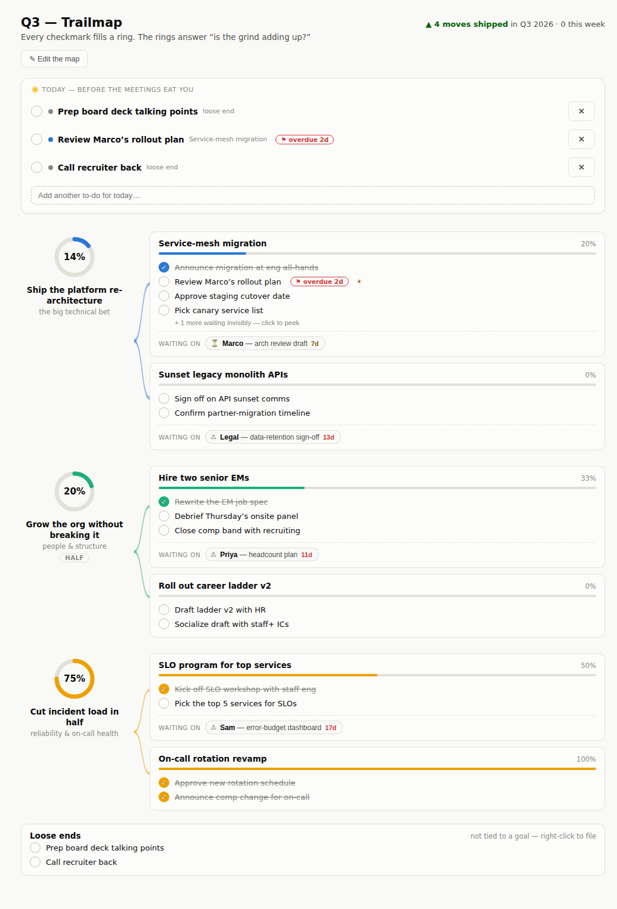

# Trailmap

**A visual map of your quarter — because a text list never tells you whether the grind is adding up.**

Trailmap is a macOS desktop app for people whose work fans out through other people (it was designed for a VP of Engineering). Instead of a to-do list, you get one picture: quarterly priorities as **progress rings** that visibly fill as any task beneath them completes, initiatives as cards, your own next actions capped at three visible at a time, and the things you're waiting on other people for — aging in days until the app tells you it's time to nudge.



## The ideas inside

| Concept | What it means |
|---|---|
| **Goal (priority)** | A quarterly bet ("Ship the platform re-architecture"). Rendered as a ring that fills as its tasks complete. Goals can have a longer **horizon** — `half` or `year` (e.g. hiring) — shown as a tag; long-horizon goals survive quarter rollovers. |
| **Initiative** | A workstream under a goal, with its own progress bar. |
| **Move** | A single next action, always starting with a verb. Only the **top 3 open moves** per initiative are visible (the Now/Later rule) — the rest wait invisibly until you peek or promote them. |
| **Waiting on** | A people-shaped dependency ("Priya — headcount plan"). Chips age in days: amber at 5, red at 10, with a notification at each threshold — once, never nagging. Click a chip when the thing arrives. |
| **Today** | Your daily workbench. Pin any move to it (right-click → *Add to Today*), quick-add ad-hoc to-dos, check things off. When it's empty, Trailmap suggests one move and tells you why. |
| **Loose ends** | Quick-added to-dos that don't belong to any goal. Zero-friction capture; file them into an initiative later (right-click) or just finish them. They count toward momentum. |
| **Due dates** | Optional, per move (right-click → *Set due date*). Chips show due/overdue state; notifications fire the morning it's due and once more if it slips. Due items jump the suggestion queue. |
| **Momentum** | "N moves shipped in Q3 2026 · M this week" — computed from real completion dates within the current calendar quarter. |

## Install & run

Requires **Node.js ≥ 20.17** (LTS recommended — the install fails fast with a clear message on older Node).

```bash
git clone <this repo>   # or you already have it
cd trailmap
npm install
npm start
```

First launch seeds sample data so the map isn't empty — replace it with your real quarter via **✎ Edit the map**, or import your own data (below).

### Package as a Mac app

```bash
npm run dist            # → dist/Trailmap-<version>-arm64.dmg
```

Open the .dmg, drag Trailmap to Applications. The build is unsigned: the **first** launch needs right-click → **Open** (macOS remembers after that).

## Daily use

- **Morning:** open Trailmap. The Today card either shows what you pinned, or suggests one move — overdue first, then due-today, then whichever goal's ring is furthest behind. Pin it, do it, check it.
- **Check off a move** and watch its initiative bar and goal ring respond — that's the point of the whole app.
- **Right-click any move** for the menu: *Add to / Remove from Today*, *Set / Clear due date*, *Delete* — and on loose ends, *file under* an initiative.
- **Quick-add** anything in the Today card's input. No goal required; it lands in **Loose ends**.
- **✎ Edit the map** to add/rename/delete goals, initiatives, and moves; add *waiting on* chips; reorder moves (↑ puts one at the top, which also makes it "visible"); cycle a goal's horizon (quarter → half → year); un-complete a move checked by mistake.
- **When someone delivers**, click their waiting chip — it disappears, and its notifications die with it.
- **Done items stay on Today**, struck through, until the day rolls over — a small trophy shelf.

### Notifications (all automatic — nothing to configure)

| Trigger | When | How often |
|---|---|---|
| ⏳ Waiting chip at 5 days | launch + daily 9am check | once per chip |
| ⚠ Waiting chip at 10 days | 〃 | once per chip |
| ⚑ Move due today | 〃 | once per move |
| ⚑ Move overdue | 〃 | once per move |

Clicking a notification opens Trailmap. The 9am check re-arms after laptop sleep.

## Your data

- **Live file:** `~/Library/Application Support/Trailmap/trailmap.json` — one human-readable JSON document. *File → Open Data Folder* takes you there.
- **Snapshots:** every save writes one to `snapshots/`, retained on a tiered schedule (everything from the last 24 h, then one per day for 90 days, capped at 1,000). *File → Restore Snapshot…* rolls back; *File → Snapshot Now* makes one on demand.
- **Export / Import:** *File → Export Data…* writes a copy anywhere; *File → Import Data…* validates before replacing (and snapshots your current state first). Older export formats are accepted and upgraded.
- **Edit the file directly — it's supported.** Change `trailmap.json` in any editor (or hand it to Claude and describe the changes) while the app runs; the app notices and reloads. If you had unsaved in-app changes at the same moment, it snapshots *both* versions and asks which wins. Writes are atomic — a crash mid-save can never corrupt the file — and a corrupted file is set aside and auto-recovered from the latest good snapshot.

## Tuning

Every behavioral number lives in one place: `CONSTANTS` in `renderer/logic.js` — visible-moves cap (3), aging thresholds (5 d / 10 d), the "this week" window (7 d), the daily check hour (9), and the save debounce. Change, restart, done.

## Development

```bash
npm test                       # renderer-purity check + 43 unit tests
xvfb-run -a npm run test:e2e   # 20 Playwright e2e tests (drop xvfb-run on macOS)
node scripts/kill-test.mjs 30  # SIGKILL the app mid-save 30×; file must survive
```

Architecture rules that matter (full plan in `docs/PLAN.md`, original prototype in `docs/prototype.html`):

- **`renderer/` is platform-agnostic by law** — no Electron, no Node, enforced by `npm run check:renderer`. A future web version reuses the renderer unchanged; it talks only to the `window.trailmap` bridge (`electron/preload.js`).
- **All persistence goes through the StorageProvider contract** (`electron/storage/`). Only the main process touches the disk; saves are atomic (temp file → fsync → rename) and refuse to clobber external edits. Swapping in SQLite later touches nothing above the interface.
- **Notifications are exactly-once per tier** — the recorded tier is part of the data model, so relaunching never re-fires.

### Manual verification checklist

- [ ] Light & dark mode (System Settings → Appearance)
- [ ] Notification click focuses the app (back-date a chip's `since` or a move's `due` in the data file to test quickly)
- [ ] Force-quit during rapid edits → data file always loads
- [ ] Mangle the JSON by hand → next launch recovers from a snapshot, bad file set aside
- [ ] Edit the data file externally while the app runs → UI updates
- [ ] Keyboard-only: tab to any check/chip/button, Enter activates
- [ ] VoiceOver spot-check: rings/chips announce name + state

## Roadmap (from `docs/PLAN.md` §12)

Quarter archive & rollover (with what-shipped retrospective; long-horizon goals carry forward) · global quick-add hotkey · a more queryable store behind the same storage interface · signed/notarized distribution · menu-bar mini-view · a web version (the renderer is already ready).

---

*Built with Claude from a prototype that started life as a conversation about why text to-do lists don't work for visual thinkers.*
